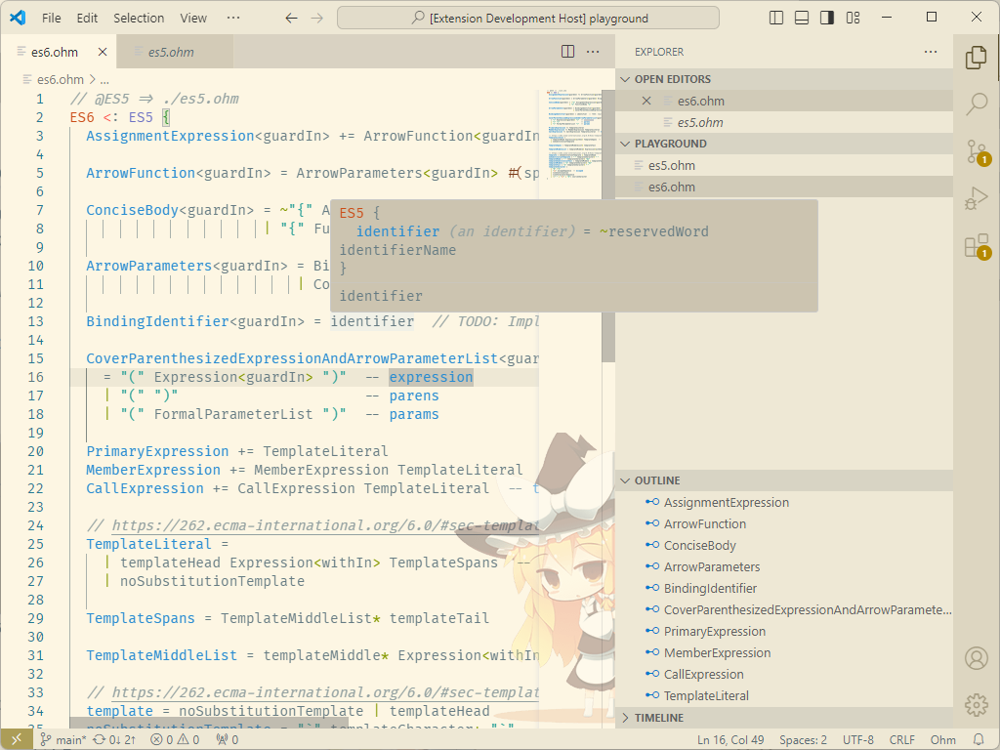

# VSCode Ohm Language Extension

Unofficial [ohm-js] language extension.

## Features

- Syntax highlight
- Jump to definition
- Hover to show definition source

## Super Grammar Reference

Use the below comment format to specify the referenced grammar file. Please see [example](./example/es6.ohm).

```ts
// @GrammarName => path/to/grammar.ohm
```

## Screenshot



## Credit

Ohm language/syntax config is copied from https://github.com/attilah/ohm-vscode

[ohm-js]: https://ohmjs.org/
